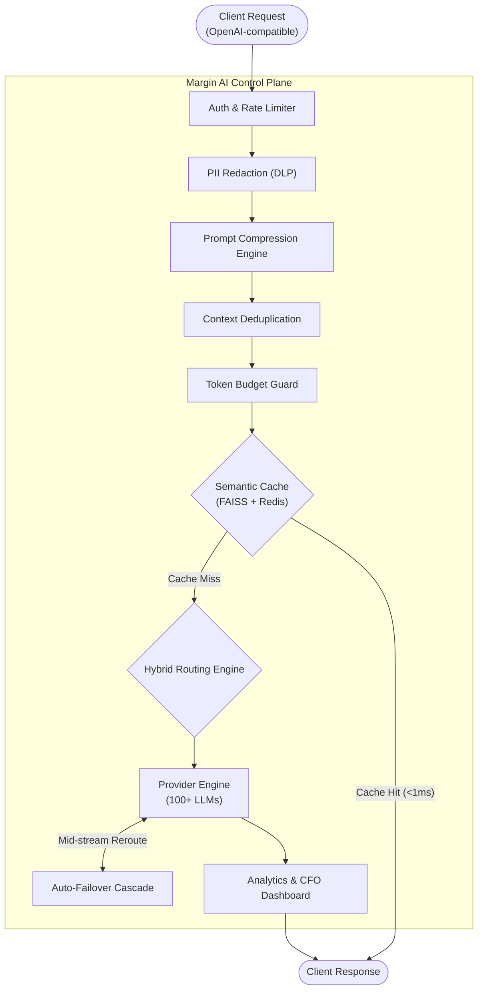

# System Architecture

## Enterprise Deep-Tech Architecture for LLM Inference Optimization

Margin AI's architecture is engineered for enterprise-scale deployments with sub-millisecond latency, zero-trust security, and horizontal scalability at its core. Every component is designed to operate within your VPC with no external dependencies.

---

## High-Level Architecture



---

## Component Deep Dive

### Compression Layer

The Prompt Compression Engine operates at the wire boundary between your application and the LLM provider. It analyzes the outbound payload structure and applies token-level optimizations:

- **Structural Token Elimination:** Strips redundant JSON syntax tokens (braces, brackets, quotes, colons) from data-heavy payloads. Field names are declared once and reused via positional mapping.
- **Message-Level Deduplication:** Hashes each message in the `messages[]` array using SHA-256. Identical message blocks across consecutive requests are collapsed into compressed references.
- **Semantic Chunking:** For oversized context windows, the engine identifies semantically redundant passages and consolidates them without loss of critical information.

**Performance:** 30-60% input token reduction at &lt;0.5ms processing latency.

### Caching Layer

The Semantic Cache is built on two tiers:

- **Tier 1 — Exact Match (Redis):** SHA-256 hash of the normalized prompt serves as the cache key. O(1) lookup with configurable TTL.
- **Tier 2 — Fuzzy Match (FAISS):** Sentence-transformer embeddings (`all-MiniLM-L6-v2`, 384-dimensional) are stored in a FAISS IndexIDMap. Sub-millisecond approximate nearest neighbor search identifies semantically equivalent queries that don't hash-match exactly.

**Data Integrity Guarantee:** The FAISS IndexIDMap architecture ensures 1:1 synchronization between vector embeddings and cached response hashes. Thread-safe RLock protects against concurrent write corruption.

### Routing Layer

Two-layer hybrid classification engine:

- **Layer 1 — Heuristic Fast Path (&lt;1ms):** Keyword analysis, prompt length scoring, structural cue detection (code blocks, JSON, mathematical notation). High-confidence classifications bypass ML entirely.
- **Layer 2 — Embedding Classifier:** For ambiguous prompts (heuristic score in the 0-5 range), the engine computes cosine similarity against pre-computed exemplar embeddings for "complex" and "trivial" workload archetypes.

**Accuracy:** 95%+ classification accuracy on production workloads. False positives (routing a complex task to a lean model) are caught by the auto-failover cascade.

### Security Layer

Two-pass PII redaction pipeline:

- **Pass 1 — Regex Engine:** Compiled regex patterns for SSN, credit card (Luhn-validated), email, phone, IP address, and custom entity types. Covers ~80% of PII patterns in &lt;1ms.
- **Pass 2 — Presidio NLP:** Microsoft Presidio's SpaCy-backed Named Entity Recognition engine for contextual PII detection. Understands that "Order #555-1234" is an order number, not a phone number.
- **Prompt Injection Shield:** Multi-layer defense including Unicode homoglyph normalization, Base64 chunk decoding, and pattern matching against known injection signatures.

### Failover Layer

Cascading multi-provider failover with health-aware routing:

- Provider health scores are updated on every request based on latency, error rate, and rate limit proximity.
- On failure (HTTP 429, 500, 502, 503, timeout), the request is automatically rerouted to the next healthiest provider **within the same SSE stream** — the client experiences zero interruption.
- Configurable retry policies with exponential backoff and jitter.

---

## Data Flow Pipeline

```
1. Request Ingestion     →  FastAPI async handler validates OpenAI-compatible payload
2. Authentication        →  API key validation and per-key rate limiting
3. PII Redaction         →  Two-pass DLP scans full messages[] array
4. Prompt Compression    →  Wire-level token optimization
5. Context Deduplication →  Hash-based message collapse
6. Token Budget Check    →  Enforce max_input_tokens ceiling
7. Semantic Cache Lookup →  Exact hash → FAISS fuzzy search → Cache miss
8. Routing Decision      →  Heuristic → Embedding classifier → Model selection
9. Provider Dispatch     →  Forward to selected LLM provider (streaming or blocking)
10. Failover (if needed) →  Cascade to next provider mid-stream
11. Response Capture     →  Token counting, cost calculation, cache population
12. Analytics Emission   →  Real-time metrics to CFO Dashboard
13. Response Delivery    →  OpenAI-compatible response to client
```

---

## Technology Stack

### Backend
| Component | Technology |
| :--- | :--- |
| **Runtime** | Python 3.11+ with FastAPI (async, non-blocking) |
| **API Standard** | OpenAI-compatible REST API |
| **Concurrency** | Async/await with uvicorn ASGI server |
| **Containerization** | Docker & Docker Compose |

### ML / Statistical
| Component | Technology |
| :--- | :--- |
| **Vector Search** | FAISS (Facebook AI Similarity Search) with IndexIDMap |
| **Embeddings** | Sentence-Transformers (`all-MiniLM-L6-v2`, 384-dim) |
| **NLP / NER** | Microsoft Presidio Analyzer + Anonymizer |
| **Tokenization** | OpenAI tiktoken (`cl100k_base` encoding) |

### Observability
| Component | Technology |
| :--- | :--- |
| **Cache** | Redis (response store, TTL management) |
| **In-Memory Fallback** | LRU Cache (bounded, OOM-safe) |
| **Analytics** | Built-in real-time dashboard (HTML/JS) |
| **Logging** | Structured Python logging with request correlation |

---

## Deployment Architecture

### Docker Deployment

```yaml
# docker-compose.yml
services:
  margin-ai:
    build: .
    ports:
      - "8000:8000"
    env_file: .env
    depends_on:
      - redis
    restart: always

  redis:
    image: redis:7-alpine
    ports:
      - "6379:6379"
    volumes:
      - redis-data:/data
```

### Kubernetes Deployment

```yaml
apiVersion: apps/v1
kind: Deployment
metadata:
  name: margin-ai-gateway
spec:
  replicas: 3
  selector:
    matchLabels:
      app: margin-ai
  template:
    spec:
      containers:
        - name: gateway
          image: ramprag/margin_ai:latest
          ports:
            - containerPort: 8000
          resources:
            requests:
              memory: "512Mi"
              cpu: "500m"
            limits:
              memory: "2Gi"
              cpu: "2000m"
```

---

## Security Architecture

### Data Security
- **Zero Egress:** All processing occurs within your VPC. No telemetry, no phone-home, no external dependencies.
- **Encryption at Rest:** Redis data encrypted via volume-level encryption.
- **Encryption in Transit:** TLS 1.3 for all provider-bound API calls.
- **Key Isolation:** Per-tenant API key management with scoped permissions.

### Privacy Controls
- **PII Redaction:** Automatic, configurable, two-pass pipeline.
- **Prompt Injection Defense:** Multi-layer detection prevents adversarial prompt manipulation.
- **Audit Trail:** Every redaction event is logged with entity type, position, and confidence score.

### Compliance
- **SOC2 Ready:** VPC-local deployment + PII redaction = SOC2 compliance posture.
- **HIPAA Ready:** PHI never leaves your infrastructure boundary.
- **GDPR Ready:** No personal data processed outside your jurisdiction.

---

## Performance Characteristics

### Throughput Benchmarks

| Metric | Value |
| :--- | :--- |
| **Added Latency (p50)** | 1.2ms |
| **Added Latency (p99)** | 2.8ms |
| **Cache Hit Latency** | 0.3ms |
| **Max Concurrent Streams** | 5,000+ (single instance) |
| **Semantic Cache Search** | &lt;1ms (FAISS, 10K vectors) |
| **PII Redaction (Pass 1)** | &lt;1ms |
| **PII Redaction (Pass 2)** | 3-8ms (Presidio NLP) |
| **Routing Classification** | &lt;1ms (heuristic) / 5ms (embedding) |

### Scalability
- **Horizontal:** API layer scales horizontally behind any load balancer (Nginx, HAProxy, ALB).
- **Vertical:** FAISS index and embedding model benefit from additional RAM.
- **Stateless Core:** Gateway instances are stateless — Redis handles all shared state.

---

## Extensibility

### Adding Custom Routing Rules

```python
# backend/core/router.py — extend the heuristic keywords
routing_engine.complexity_keywords["high"].extend([
    "your_domain_keyword",
    "custom_complex_pattern"
])
```

### Adding Custom PII Patterns

```python
# backend/core/security.py — add custom regex patterns
CUSTOM_PATTERNS = {
    r'\b[A-Z]{2}\d{6}\b': '[EMPLOYEE_ID]',  # Custom employee ID format
    r'\bMRN-\d{8}\b': '[MEDICAL_RECORD]',     # Medical record numbers
}
```

### Adding Custom Provider Models

```python
# backend/core/providers.py — register new models
PROVIDER_REGISTRY["your-custom-model"] = {
    "provider": "openai",
    "model_id": "ft:gpt-4o-2024-05-13:your-org::model-id",
    "pricing": {"input": 3.0, "output": 6.0}
}
```

---

## Next Steps

- [Prompt Compression Engine →](https://trymargin-ai.github.io/inference-gateway/prompt-compression)
- [Context Deduplication →](https://trymargin-ai.github.io/inference-gateway/context-deduplication)
- [API Reference →](https://trymargin-ai.github.io/inference-gateway/api-reference)
- [Performance Benchmarks →](https://trymargin-ai.github.io/inference-gateway/benchmarks)
